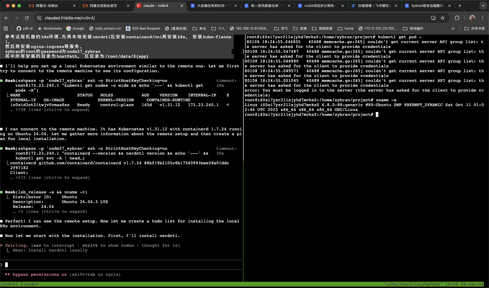
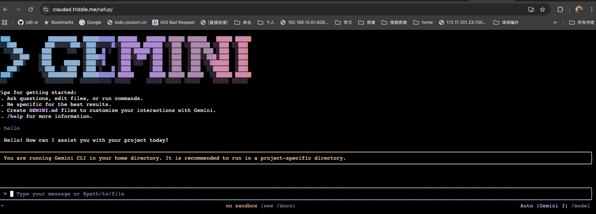

# claude for remote

> Expose your local Claude Code through web terminal anywhere - perfect for remote access and mobile devices.

⚠️ **Security Notice**: The quick start uses a demo server (clauded.friddle.me) for testing. For production use, we strongly recommend deploying your own self-hosted server to ensure full control over your data and security.

## Use Cases

**🌍 Remote Access**
- Access your Claude Code from anywhere in the world
- Work on your projects while traveling
- No need to expose your local machine directly

**📱 Mobile Devices**
- Use Claude Code on your phone or tablet
- Perfect for quick code reviews and responses
- Full terminal experience in mobile browser

## Quick Start

### Option 1: Quick Demo (One-Line Install)

⚠️ **Before installing, make sure you have:**
- Installed Claude Code CLI: `npm install -g @anthropic-ai/claude-code`
- Configured your API key: `export ANTHROPIC_API_KEY='your-key'` or `claude auth login`

Install and start in one command:

```bash
curl -fsSL https://raw.githubusercontent.com/friddle/claude-web-remote/main/install.sh | bash
```

This will:
1. Download the `clauded` binary to `/usr/local/bin`
2. Connect to the demo server at `clauded.friddle.me`
3. Generate a random session and password
4. Print the browser URL to access your Claude Code

### Option 2: Direct Binary Download

Download and run the binary directly:

```bash
# Download the binary
wget https://github.com/friddle/claude-web-remote/releases/download/v0.2/clauded-linux-amd64

# Make it executable
chmod +x clauded-linux-amd64

# Run with custom settings
./clauded-linux-amd64 \
  --env ANTHROPIC_BASE_URL=https://open.bigmodel.cn/api/anthropic \
  --env ANTHROPIC_AUTH_TOKEN=helloworld \
  --flags="--allow-dangerously-skip-permissions --dangerously-skip-permissions"
```

### Option 3: Self-Hosted Server (Recommended)

For better security and control, deploy your own server:

**1. Deploy the server on your remote machine:**

```bash
cd cmd/server
docker-compose up -d
```

The server will expose:
- Port `80` - for both client connections and browser access

**2. Connect your local machine:**

```bash
# Set your API key
export ANTHROPIC_API_KEY='your-key'

# Start clauded
clauded --remote=your-server.com --session=my-session --password=mypass
```

**3. Access in browser:**

```
http://your-server.com/my-session/
```

When prompted, enter your password.

**Client running example:**


**tmux session example:**



## Usage

### Basic Connection

```bash
# Local testing (if server is running locally)
clauded --remote=http://localhost --session=my-session --password=mypass

# Remote server
clauded --remote=https://myserver.com --session=my-session --password=mypass

# Demo server
clauded --remote=https://clauded.friddle.me --session=my-session --password=mypass
```

### Set API Key

```bash
# Method 1: Environment variable
export ANTHROPIC_API_KEY='your-key'
clauded --remote=myserver.com --session=my-session --password=mypass

# Method 2: Pass via --env
clauded --remote=myserver.com --session=my-session --password=mypass \
  --env ANTHROPIC_API_KEY='your-key'

# Method 3: Use .env file in your project directory
echo "ANTHROPIC_API_KEY=your-key" > .env
clauded --remote=myserver.com --session=my-session --password=mypass
```

### Pass Flags to Claude

```bash
# Use specific model
clauded --remote=myserver.com --session=my-session --password=mypass \
  --flags='--model opus'

# Multiple flags
clauded --remote=myserver.com --session=my-session --password=mypass \
  --flags='--model opus --max-tokens 4096'
```

### Use Different AI Tools

```bash
# Claude (default)
clauded --remote=myserver.com --session=my-session --password=mypass

# OpenCode
clauded --remote=myserver.com --session=my-session --password=mypass \
  --codecmd=opencode

# Kimi
clauded --remote=myserver.com --session=my-session --password=mypass \
  --codecmd=kimi

# Gemini
clauded --remote=myserver.com --session=my-session --password=mypass \
  --codecmd=gemini
```

**Gemini example:**



### Mobile Device Access

```bash
# Start session on your local machine
clauded --remote=myserver.com --session=mobile --password=pass123

# Access on your phone at: http://myserver.com/mobile/
```

### Multiple Sessions

Run multiple sessions simultaneously:

```bash
# Terminal 1 - work session
clauded --remote=localhost --session=work --password=workpass

# Terminal 2 - test session
clauded --remote=localhost --session=test --password=testpass

# Terminal 3 - mobile session
clauded --remote=localhost --session=mobile --password=mobilepass
```

**Web interface example:**


## Client Parameters

| Parameter | Short | Default | Description |
|----------|-------|---------|-------------|
| `--remote` | - | `https://clauded.friddle.me` | Server address (URL or host:port) |
| `--session` | - | Auto-generated | Session ID for URL and auth |
| `--password` | - | Empty | Password for authentication |
| `--codecmd` | - | `claude` | AI tool to use (claude, opencode, kimi, gemini) |
| `--flags` | - | Empty | Flags to pass to codecmd |
| `--env` | - | Empty | Environment variables (repeatable) |
| `--daemon` | `-d` | `true` | Run as daemon in background |

## Troubleshooting

### Connection Failed

**Access URL:** All browser access goes through `http://your-server-ip/`

Ensure firewall allows:
- Port `80` (HTTP) and `443` (HTTPS) - for both client and browser connections.

### Claude Command Not Found

claude for remote automatically finds:
- `claude` in system PATH

If not found, it will attempt to install it automatically. You can also install it manually:
```bash
npm install -g @anthropic-ai/claude-code
```

## How It Works

```
Your Local Machine           Remote Server              Browser (Any Device)
┌─────────────┐            ┌──────────────┐           ┌─────────────┐
│  Claude Code│            │              │           │             │
│             │            │  Go Server   │◄──────────│  Web Browser│
│  clauded    │───────────►│  :80         │           │             │
│  (gotty+    │  piko      │              │           │             │
│   piko)     │  :80       │  Piko Proxy  │           │             │
└─────────────┘            └──────────────┘           └─────────────┘
```

## License

MIT
