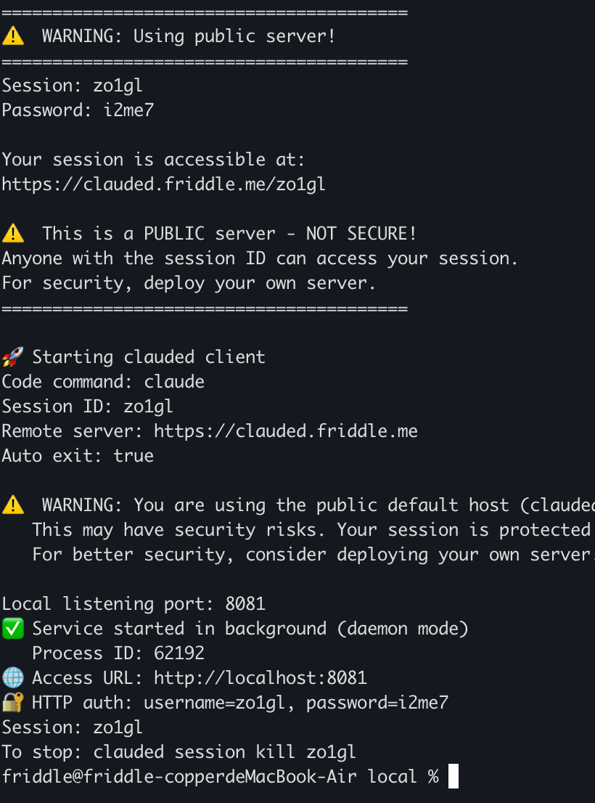
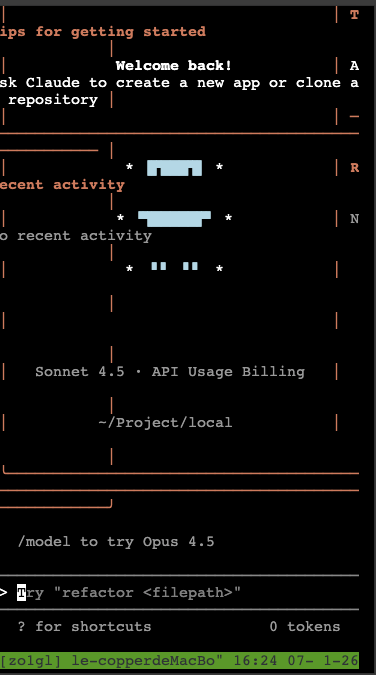

# ClauDED

> 随时随地通过 Web 终端访问本地 Claude Code - 适合远程访问和移动设备

⚠️ **安全提示**: 快速开始使用演示服务器 (clauded.friddle.me) 进行测试。在生产环境中，我们强烈建议部署自己的自托管服务器，以确保对数据和安全的完全控制。

## 使用场景

**🌍 远程访问**
- 从世界任何地方访问您的 Claude Code
- 旅行时继续处理项目
- 无需直接暴露本地机器

**📱 移动设备**
- 在手机或平板上使用 Claude Code
- 适合快速代码审查和回复
- 移动浏览器中的完整终端体验

## 快速开始

### 方式 1: 快速演示（一键安装）

⚠️ **安装前请确保:**
- 已安装 Claude Code CLI: `npm install -g @anthropic-ai/claude-code`
- 已配置 API 密钥: `export ANTHROPIC_API_KEY='your-key'` 或 `claude auth login`

一键安装并启动:

```bash
curl -fsSL https://raw.githubusercontent.com/friddle/clauded/main/install.sh | bash
```

这将:
1. 下载 `clauded` 二进制文件到 `/usr/local/bin`
2. 连接到演示服务器 `clauded.friddle.me:8022`
3. 生成随机的会话和密码
4. 打印访问 Claude Code 的浏览器 URL

### 方式 2: 自托管服务器（推荐）

为了更好的安全性和控制，部署您自己的服务器:

**1. 在远程机器上部署服务器:**

```bash
cd server
docker-compose up -d
```

服务器将开放:
- 端口 `8022` - 用于客户端连接
- 端口 `8088` - 用于浏览器访问

**2. 连接您的本地机器:**

```bash
# 设置 API 密钥
export ANTHROPIC_API_KEY='your-key'

# 启动 clauded
clauded --host=your-server.com:8022 --session=my-session --password=mypass
```

**3. 在浏览器中访问:**

```
http://your-server.com:8088/my-session/
```

输入密码即可访问。

**客户端运行示例:**



## 使用方法

### 基本连接

```bash
# 本地测试
clauded --host=localhost:8022 --session=my-session --password=mypass

# 远程服务器
clauded --host=myserver.com:8022 --session=my-session --password=mypass

# 演示服务器
clauded --host=clauded.friddle.me:8022 --session=my-session --password=mypass
```

### 设置 API 密钥

```bash
# 方法 1: 环境变量
export ANTHROPIC_API_KEY='your-key'
clauded --host=myserver.com:8022 --session=my-session --password=mypass

# 方法 2: 通过 --env 传递
clauded --host=myserver.com:8022 --session=my-session --password=mypass \
  --env ANTHROPIC_API_KEY='your-key'

# 方法 3: 在项目目录中使用 .env 文件
echo "ANTHROPIC_API_KEY=your-key" > .env
clauded --host=myserver.com:8022 --session=my-session --password=mypass
```

### 传递参数给 Claude

```bash
# 使用特定模型
clauded --host=myserver.com:8022 --session=my-session --password=mypass \
  --flags='--model opus'

# 多个参数
clauded --host=myserver.com:8022 --session=my-session --password=mypass \
  --flags='--model opus --max-tokens 4096'
```

### 使用不同的 AI 工具

```bash
# Claude (默认)
clauded --host=myserver.com:8022 --session=my-session --password=mypass

# OpenCode
clauded --host=myserver.com:8022 --session=my-session --password=mypass \
  --codecmd=opencode

# Kimi
clauded --host=myserver.com:8022 --session=my-session --password=mypass \
  --codecmd=kimi

# Gemini
clauded --host=myserver.com:8022 --session=my-session --password=mypass \
  --codecmd=gemini
```

### 移动设备访问

```bash
# 在本地机器上启动会话
clauded --host=myserver.com:8022 --session=mobile --password=pass123

# 在手机上访问: http://myserver.com:8088/mobile/
```

### 多会话

同时运行多个会话:

```bash
# 终端 1 - 工作会话
clauded --host=localhost:8022 --session=work --password=workpass

# 终端 2 - 测试会话
clauded --host=localhost:8022 --session=test --password=testpass

# 终端 3 - 移动会话
clauded --host=localhost:8022 --session=mobile --password=mobilepass
```

**Web 界面示例:**



## 客户端参数

| 参数 | 简写 | 默认值 | 描述 |
|----------|-------|---------|-------------|
| `--host` | `-h` | **必需** | 服务器地址 (host:port) |
| `--session` | `-s` | 自动生成 | URL 和认证的会话 ID |
| `--password` | `-p` | 空 | 认证密码 |
| `--codecmd` | - | claude | AI 工具 (claude, opencode, kimi, gemini) |
| `--flags` | `-f` | 空 | 传递给 codecmd 的参数 |
| `--env` | `-e` | 空 | 环境变量 (可重复) |

## 故障排除

### 连接失败

**访问地址:** 所有浏览器访问统一使用 `http://服务器IP:8088/`

确保防火墙允许:
- 端口 `8022` - 客户端到服务器（用于 clauded 连接）
- 端口 `8088` - 浏览器到服务器（默认端口，可在 docker-compose.yaml 中修改）

### 找不到 Claude 命令

ClauDED 会自动查找:
- 系统路径中的 `claude`
- 系统路径中的 `claude-code`
- `~/.local/bin/claude-code`

如果找不到，先安装 Claude Code:
```bash
npm install -g @anthropic-ai/claude-code
```

## 工作原理

```
您的本地机器              远程服务器                浏览器 (任何设备)
┌─────────────┐            ┌──────────────┐           ┌─────────────┐
│  Claude Code│            │              │           │             │
│             │            │  Go Server   │◄──────────│  Web Browser│
│  clauded    │───────────►│  :8088       │           │             │
│  (gotty+    │  piko      │              │           │             │
│   piko)     │  :8022     │  Piko Proxy  │           │             │
└─────────────┘            └──────────────┘           └─────────────┘
```

## 许可证

MIT
